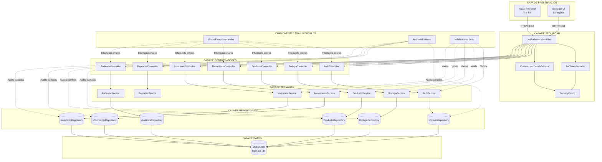
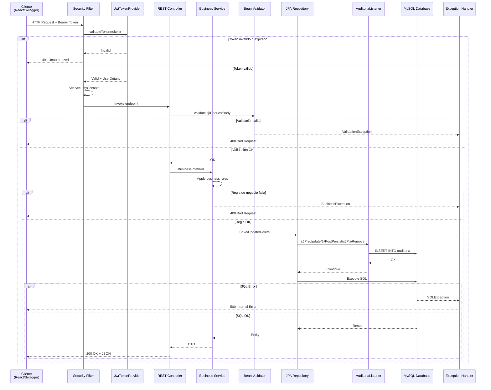
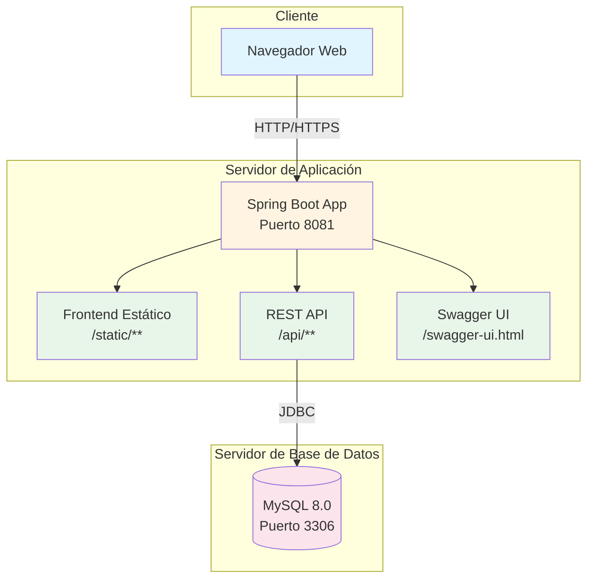
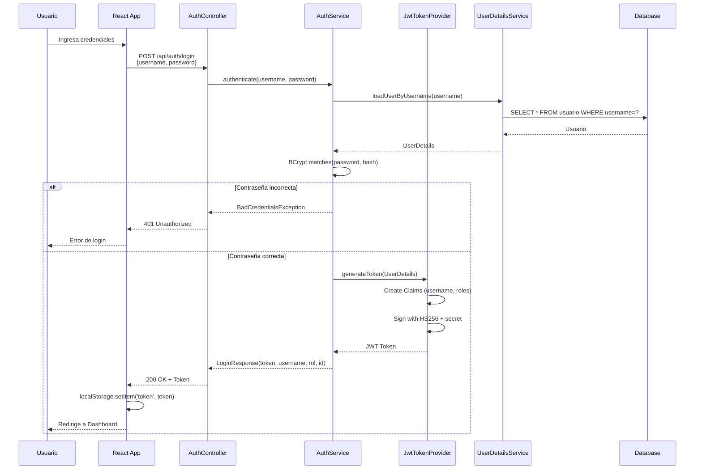

# Arquitectura del Sistema LogiTrack

Este documento describe la arquitectura completa del sistema LogiTrack, incluyendo sus capas, componentes y flujos de datos.

## Arquitectura General del Sistema



## Arquitectura en Capas Detallada

```mermaid
graph LR
    subgraph "Frontend Layer"
        A1[React App]
        A2[Context API<br/>Auth, Search, Theme]
        A3[Components<br/>10 Vistas]
    end

    subgraph "API Gateway Layer"
        B1[Spring Boot<br/>Tomcat Embebido]
        B2[CORS Filter]
        B3[Security Filter Chain]
    end

    subgraph "Security Layer"
        C1[JWT Authentication]
        C2[Role-Based Access<br/>ADMIN/EMPLEADO]
        C3[BCrypt Passwords]
    end

    subgraph "Controller Layer"
        D1[REST Controllers<br/>9 Controladores]
        D2[Request Mapping]
        D3[Response Entity]
    end

    subgraph "Service Layer"
        E1[Business Logic]
        E2[Validaciones Negocio]
        E3[Transacciones]
    end

    subgraph "Repository Layer"
        F1[JPA Repositories<br/>8 Repositorios]
        F2[Query Methods]
        F3[Custom Queries]
    end

    subgraph "Persistence Layer"
        G1[Hibernate ORM]
        G2[Entity Listeners]
        G3[Transaction Manager]
    end

    subgraph "Database Layer"
        H1[(MySQL 8.0)]
        H2[8 Tablas]
        H3[Constraints & Triggers]
    end

    A1 --> A2
    A2 --> A3
    A3 -->|HTTP/JSON| B1

    B1 --> B2
    B2 --> B3
    B3 --> C1

    C1 --> C2
    C2 --> C3
    C3 --> D1

    D1 --> D2
    D2 --> D3
    D3 --> E1

    E1 --> E2
    E2 --> E3
    E3 --> F1

    F1 --> F2
    F2 --> F3
    F3 --> G1

    G1 --> G2
    G2 --> G3
    G3 --> H1

    H1 --> H2
    H2 --> H3
```



## Flujo de Petición Completo



## Componentes Principales

### 1. Capa de Presentación

#### Frontend React
```
- Framework: React 18.2.0
- Build Tool: Vite 5.0.0
- State Management: Context API (Auth, Search, Theme)
- Routing: Single Page Application
- Comunicación: Fetch API con wrapper personalizado
```

**Características:**
- 10 vistas completas
- Tema oscuro/claro persistente
- Validaciones en tiempo real
- Estados de carga y error
- Internacionalización (i18n)

#### Swagger UI
```
- Librería: SpringDoc OpenAPI 2.7.0
- Ruta: /swagger-ui.html
- Soporte JWT: Botón "Authorize"
- Esquemas: Modelos con validaciones visibles
```

### 2. Capa de Seguridad (Spring Security)

#### JwtAuthenticationFilter
```java
- Tipo: OncePerRequestFilter
- Función: Interceptar requests y validar JWT
- Header: Authorization: Bearer <token>
- Flujo:
  1. Extrae token del header
  2. Valida token con JwtTokenProvider
  3. Establece SecurityContext
  4. Continúa cadena de filtros
```

#### JwtTokenProvider
```java
- Algoritmo: HS256 (HMAC-SHA256)
- Secret: Configurable via jwt.secret
- Validez: 1 hora (configurable)
- Claims: username (sub), roles
- Métodos:
  - generateToken(UserDetails)
  - validateToken(String)
  - getUsername(String)
  - getRoles(String)
```

#### CustomUserDetailsService
```java
- Implementa: UserDetailsService
- Fuente: UsuarioRepository
- Carga: Usuario por username
- Authorities: ROLE_ADMIN o ROLE_EMPLEADO
```

#### SecurityConfig
```java
- CSRF: Deshabilitado (API stateless)
- CORS: Configurado para frontend
- Session: Stateless (SessionCreationPolicy.STATELESS)
- Rutas públicas: /api/auth/**, /swagger-ui/**, /v3/api-docs/**
- Rutas protegidas: /api/** (requiere autenticación)
- Rutas ADMIN: /api/bodegas/** (POST/PUT/DELETE), /api/auditoria/**
```

### 3. Capa de Controladores

#### Responsabilidades
- Mapeo de rutas HTTP
- Validación de entrada (@Valid)
- Conversión DTO ↔ Entity
- Manejo de respuestas HTTP
- Documentación Swagger (@Tag, @Operation)

#### Controladores Implementados

| Controlador | Rutas | Funciones |
|------------|-------|-----------|
| AuthController | /api/auth/** | Login, Register |
| BodegaController | /api/bodegas/** | CRUD Bodegas |
| ProductoController | /api/productos/** | CRUD Productos + Consultas |
| MovimientoController | /api/movimientos/** | CRUD Movimientos + Filtros |
| InventarioController | /api/inventario/** | CRUD Inventario + Ajustes |
| ReportesController | /api/reportes/** | Reportes y estadísticas |
| AuditoriaController | /api/auditoria/** | Consulta de auditoría |
| UsuarioController | /api/usuarios/** | Consultas de usuarios |
| CategoriaController | /api/categorias/** | Listar categorías |

### 4. Capa de Servicios

#### Responsabilidades
- Lógica de negocio
- Validaciones de negocio
- Transacciones (@Transactional)
- Coordinación entre repositorios
- Cálculos y agregaciones
- Multitenancy (filtrado por empresa)

#### Validaciones de Negocio Clave

**MovimientoService:**
```
- ENTRADA: bodegaDestino != null, bodegaOrigen == null
- SALIDA: bodegaOrigen != null, bodegaDestino == null, stock >= cantidad
- TRANSFERENCIA: ambas bodegas != null, diferentes, stock >= cantidad
- Actualización automática de inventario
```

**InventarioService:**
```
- Stock >= 0 siempre
- Stock <= capacidad de bodega
- Unique(bodega, producto)
```

**BodegaService:**
```
- Capacidad > 0
- Encargado existe y pertenece a la misma empresa
- Nombre único por empresa
```

### 5. Capa de Repositorios

#### JpaRepository
Todos los repositorios extienden `JpaRepository<Entity, Long>`:

```java
public interface ProductoRepository extends JpaRepository<Producto, Long> {
    List<Producto> findByStockLessThan(Integer threshold);
    Page<Producto> findByEmpresaId(Long empresaId, Pageable pageable);
    List<Producto> findByCategoriaAndEmpresaId(String categoria, Long empresaId);
}
```

#### Query Methods
- Derivación automática de queries
- Consultas personalizadas con @Query
- Paginación y ordenamiento (Pageable)
- Proyecciones y DTOs

### 6. Componentes Transversales

#### GlobalExceptionHandler
```java
@ControllerAdvice
- Captura excepciones globalmente
- Formatea respuestas de error
- HTTP Status codes apropiados
- Logging de errores

Excepciones capturadas:
- ResourceNotFoundException → 404
- BusinessException → 400
- ValidationException → 400
- MethodArgumentNotValidException → 400
- SQLException → 500
- Exception → 500
```

#### AuditoriaListener
```java
@EntityListeners(AuditoriaListener.class)
- Intercepta eventos JPA
- @PostPersist → INSERT
- @PreUpdate → UPDATE
- @PreRemove → DELETE
- Serializa objetos a JSON
- Captura usuario actual (SecurityContext)
- Guarda en tabla auditoria
```

#### Bean Validation
```java
Anotaciones utilizadas:
- @NotNull, @NotBlank
- @Size(min, max)
- @Min, @Max
- @DecimalMin, @Digits
- @Email
- @Pattern
- @Column(unique=true)
```

## Patrones Arquitectónicos

### 1. Layered Architecture (Arquitectura en Capas)
- Separación clara de responsabilidades
- Dependencias unidireccionales (top-down)
- Bajo acoplamiento, alta cohesión

### 2. Repository Pattern
- Abstracción del acceso a datos
- Facilita testing con mocks
- Centraliza queries

### 3. Service Layer Pattern
- Lógica de negocio independiente
- Transacciones manejadas centralmente
- Reutilización de lógica

### 4. DTO Pattern
- Separación entre modelo de dominio y API
- Control de exposición de datos
- Optimización de payload

### 5. Dependency Injection
- Spring IoC Container
- Constructor injection (recomendado)
- Facilita testing y mantenimiento

### 6. Event-Driven (Auditoría)
- JPA Entity Listeners
- Desacoplamiento de auditoría
- Registro automático sin código repetido

## Diagrama de Despliegue



## Flujo de Autenticación JWT



## Configuración de CORS

```java
@Bean
public CorsConfigurationSource corsConfigurationSource() {
    CorsConfiguration configuration = new CorsConfiguration();
    configuration.setAllowedOrigins(Arrays.asList(
        "http://localhost:5173",  // Vite dev server
        "http://localhost:3000",  // Alternate frontend
        "http://localhost:8081"   // Same origin
    ));
    configuration.setAllowedMethods(Arrays.asList("GET", "POST", "PUT", "DELETE", "OPTIONS"));
    configuration.setAllowedHeaders(Arrays.asList("Authorization", "Content-Type"));
    configuration.setAllowCredentials(true);
    return source;
}
```

## Tecnologías por Capa

| Capa | Tecnologías |
|------|-------------|
| Presentación | React 18, Vite 5, CSS3, Fetch API |
| Seguridad | Spring Security 6, JJWT 0.11.5, BCrypt |
| Controladores | Spring Web MVC, Jakarta Validation, SpringDoc OpenAPI |
| Servicios | Spring Core, Spring TX (Transactions) |
| Repositorios | Spring Data JPA, Hibernate 6 |
| Persistencia | MySQL Connector 8, HikariCP (Pool) |
| Base de Datos | MySQL 8.0, InnoDB, UTF8MB4 |

## Métricas de Arquitectura

- **Acoplamiento**: Bajo (dependencias inyectadas)
- **Cohesión**: Alta (responsabilidad única por capa)
- **Escalabilidad**: Horizontal (stateless API)
- **Mantenibilidad**: Alta (separación clara de capas)
- **Testabilidad**: Alta (inyección de dependencias)
- **Seguridad**: Múltiples capas (JWT, validaciones, constraints)

## Consideraciones de Rendimiento

### Optimizaciones Implementadas
1. **Lazy Loading**: Relaciones OneToMany cargadas bajo demanda
2. **Paginación**: Endpoints con `Pageable` para grandes datasets
3. **Índices DB**: Primary Keys, Foreign Keys, Unique constraints
4. **Connection Pool**: HikariCP configurado
5. **Cache de Sesión**: Stateless (sin sesión en servidor)
6. **CORS Preflight**: Optimizado con allowCredentials

### Límites Configurados
- **Max HTTP POST Size**: 10 MB
- **Max File Size**: 10 MB
- **Connection Timeout**: Default Tomcat
- **JWT Validity**: 1 hora (configurable)

---

[⬅ Volver al README principal](../README.md)
