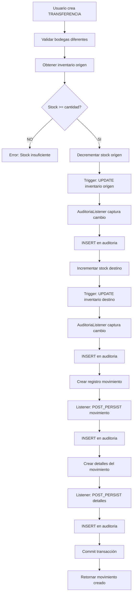

# Diagrama de Base de Datos - LogiTrack

Este documento describe el esquema completo de la base de datos del sistema LogiTrack, incluyendo todas las tablas, relaciones, constraints y triggers.

## Diagrama Entidad-Relación (ERD)

```mermaid
erDiagram
    EMPRESA ||--o{ USUARIO : "tiene"
    EMPRESA ||--o{ BODEGA : "posee"
    EMPRESA ||--o{ PRODUCTO : "gestiona"

    USUARIO ||--o{ BODEGA : "encarga"
    USUARIO ||--o{ MOVIMIENTO : "realiza"
    USUARIO ||--o{ AUDITORIA : "genera"

    BODEGA ||--o{ INVENTARIO_BODEGA : "contiene"
    BODEGA ||--o{ MOVIMIENTO : "origen"
    BODEGA ||--o{ MOVIMIENTO : "destino"

    PRODUCTO ||--o{ INVENTARIO_BODEGA : "almacenado_en"
    PRODUCTO ||--o{ MOVIMIENTO_DETALLE : "incluido_en"

    MOVIMIENTO ||--|{ MOVIMIENTO_DETALLE : "contiene"

    EMPRESA {
        bigint id PK "AUTO_INCREMENT"
        varchar(100) nombre UK "NOT NULL"
    }

    USUARIO {
        bigint id PK "AUTO_INCREMENT"
        varchar(50) username UK "NOT NULL"
        varchar(255) password "NOT NULL, BCrypt Hash"
        enum rol "ADMIN, EMPLEADO"
        varchar(100) nombre_completo "NOT NULL"
        varchar(100) email UK "NOT NULL, Valid Email"
        varchar(20) cedula UK "NOT NULL, 6-20 digits"
        bigint empresa_id FK "NOT NULL"
    }

    BODEGA {
        bigint id PK "AUTO_INCREMENT"
        varchar(100) nombre "NOT NULL"
        varchar(150) ubicacion "NOT NULL"
        int capacidad "NOT NULL, CHECK > 0"
        bigint encargado_id FK "NOT NULL"
        bigint empresa_id FK "NOT NULL"
    }

    PRODUCTO {
        bigint id PK "AUTO_INCREMENT"
        varchar(100) nombre "NOT NULL"
        varchar(50) categoria "NOT NULL"
        int stock "DEFAULT 0, CHECK >= 0"
        decimal(10,2) precio "NOT NULL, CHECK >= 0.01"
        bigint empresa_id FK "NOT NULL"
    }

    INVENTARIO_BODEGA {
        bigint id PK "AUTO_INCREMENT"
        bigint bodega_id FK "NOT NULL"
        bigint producto_id FK "NOT NULL"
        int stock "DEFAULT 0, CHECK >= 0"
        int stock_minimo "DEFAULT 10, CHECK >= 0"
        int stock_maximo "DEFAULT 1000, CHECK >= 0"
        timestamp ultima_actualizacion "AUTO_UPDATE"
    }

    MOVIMIENTO {
        bigint id PK "AUTO_INCREMENT"
        timestamp fecha "DEFAULT CURRENT_TIMESTAMP"
        enum tipo "ENTRADA, SALIDA, TRANSFERENCIA"
        bigint usuario_id FK "NOT NULL"
        bigint bodega_origen_id FK "NULL"
        bigint bodega_destino_id FK "NULL"
        varchar(500) observaciones "NULL"
    }

    MOVIMIENTO_DETALLE {
        bigint id PK "AUTO_INCREMENT"
        bigint movimiento_id FK "NOT NULL"
        bigint producto_id FK "NOT NULL"
        int cantidad "NOT NULL, CHECK > 0"
    }

    AUDITORIA {
        bigint id PK "AUTO_INCREMENT"
        enum operacion "INSERT, UPDATE, DELETE"
        timestamp fecha "DEFAULT CURRENT_TIMESTAMP"
        bigint usuario_id FK "NULL"
        varchar(50) entidad "NOT NULL"
        bigint entidad_id "NULL"
        longtext valores_anteriores "JSON"
        longtext valores_nuevos "JSON"
    }
```

## Tablas Detalladas

### 1. EMPRESA

**Propósito**: Multitenancy, permite aislar datos por organización.

| Columna | Tipo | Constraints | Descripción |
|---------|------|-------------|-------------|
| id | BIGINT | PK, AUTO_INCREMENT | Identificador único |
| nombre | VARCHAR(100) | NOT NULL, UNIQUE | Nombre de la empresa |

**Índices:**
- PRIMARY KEY (id)
- UNIQUE INDEX (nombre)

**Datos iniciales:**
- ID=1: "Empresa Demo"

---

### 2. USUARIO

**Propósito**: Usuarios del sistema con autenticación y autorización.

| Columna | Tipo | Constraints | Descripción |
|---------|------|-------------|-------------|
| id | BIGINT | PK, AUTO_INCREMENT | Identificador único |
| username | VARCHAR(50) | NOT NULL, UNIQUE | Nombre de usuario para login |
| password | VARCHAR(255) | NOT NULL | Hash BCrypt de contraseña |
| rol | ENUM('ADMIN','EMPLEADO') | NOT NULL | Rol del usuario |
| nombre_completo | VARCHAR(100) | NOT NULL | Nombre completo |
| email | VARCHAR(100) | NOT NULL, UNIQUE | Email válido |
| cedula | VARCHAR(20) | NOT NULL, UNIQUE | Cédula (6-20 dígitos) |
| empresa_id | BIGINT | FK, NOT NULL | Referencia a EMPRESA |

**Índices:**
- PRIMARY KEY (id)
- UNIQUE INDEX (username)
- UNIQUE INDEX (email)
- UNIQUE INDEX (cedula)
- INDEX (empresa_id)

**Foreign Keys:**
- empresa_id REFERENCES empresa(id) ON DELETE CASCADE

**Datos iniciales:**
- admin / admin123 (ADMIN)
- juan / admin123 (EMPLEADO)

---

### 3. BODEGA

**Propósito**: Almacenes físicos distribuidos geográficamente.

| Columna | Tipo | Constraints | Descripción |
|---------|------|-------------|-------------|
| id | BIGINT | PK, AUTO_INCREMENT | Identificador único |
| nombre | VARCHAR(100) | NOT NULL | Nombre de la bodega |
| ubicacion | VARCHAR(150) | NOT NULL | Dirección física |
| capacidad | INT | NOT NULL, CHECK > 0 | Capacidad máxima |
| encargado_id | BIGINT | FK, NOT NULL | Referencia a USUARIO |
| empresa_id | BIGINT | FK, NOT NULL | Referencia a EMPRESA |

**Índices:**
- PRIMARY KEY (id)
- INDEX (encargado_id)
- INDEX (empresa_id)

**Foreign Keys:**
- encargado_id REFERENCES usuario(id) ON DELETE RESTRICT
- empresa_id REFERENCES empresa(id) ON DELETE CASCADE

**Constraints:**
- CHECK (capacidad > 0)

**Datos iniciales:**
- Bodega Central (Bogotá, capacidad: 5000)
- Bodega Norte (Medellín, capacidad: 3000)
- Bodega Sur (Cali, capacidad: 2500)

---

### 4. PRODUCTO

**Propósito**: Catálogo de productos comercializados.

| Columna | Tipo | Constraints | Descripción |
|---------|------|-------------|-------------|
| id | BIGINT | PK, AUTO_INCREMENT | Identificador único |
| nombre | VARCHAR(100) | NOT NULL | Nombre del producto |
| categoria | VARCHAR(50) | NOT NULL | Categoría |
| stock | INT | DEFAULT 0, CHECK >= 0 | Stock global (calculado) |
| precio | DECIMAL(10,2) | NOT NULL, CHECK >= 0.01 | Precio unitario |
| empresa_id | BIGINT | FK, NOT NULL | Referencia a EMPRESA |

**Índices:**
- PRIMARY KEY (id)
- INDEX (categoria)
- INDEX (empresa_id)
- INDEX (stock) /* Para consultas de stock bajo */

**Foreign Keys:**
- empresa_id REFERENCES empresa(id) ON DELETE CASCADE

**Constraints:**
- CHECK (stock >= 0)
- CHECK (precio >= 0.01)

**Datos iniciales:**
- Laptop Dell - Electrónicos - $3,500,000
- Silla Oficina - Muebles - $450,000
- Teclado RGB - Electrónicos - $150,000
- Escritorio - Muebles - $1,200,000

---

### 5. INVENTARIO_BODEGA

**Propósito**: Stock real de cada producto en cada bodega (tabla de intersección enriquecida).

| Columna | Tipo | Constraints | Descripción |
|---------|------|-------------|-------------|
| id | BIGINT | PK, AUTO_INCREMENT | Identificador único |
| bodega_id | BIGINT | FK, NOT NULL | Referencia a BODEGA |
| producto_id | BIGINT | FK, NOT NULL | Referencia a PRODUCTO |
| stock | INT | DEFAULT 0, CHECK >= 0 | Cantidad actual |
| stock_minimo | INT | DEFAULT 10, CHECK >= 0 | Umbral mínimo |
| stock_maximo | INT | DEFAULT 1000, CHECK >= 0 | Capacidad máxima |
| ultima_actualizacion | TIMESTAMP | AUTO_UPDATE | Timestamp de último cambio |

**Índices:**
- PRIMARY KEY (id)
- UNIQUE INDEX (bodega_id, producto_id)
- INDEX (producto_id)
- INDEX (stock) /* Para alertas de stock bajo */

**Foreign Keys:**
- bodega_id REFERENCES bodega(id) ON DELETE CASCADE
- producto_id REFERENCES producto(id) ON DELETE CASCADE

**Constraints:**
- CHECK (stock >= 0)
- CHECK (stock_minimo >= 0)
- CHECK (stock_maximo >= stock_minimo)
- UNIQUE (bodega_id, producto_id)

**Triggers:**
```sql
CREATE TRIGGER update_inventario_timestamp
BEFORE UPDATE ON inventario_bodega
FOR EACH ROW
SET NEW.ultima_actualizacion = CURRENT_TIMESTAMP;
```

**Datos iniciales:**
- Distribución de inventario en 3 bodegas
- Total: 50 Laptops, 120 Sillas, 200 Teclados, 80 Escritorios

---

### 6. MOVIMIENTO

**Propósito**: Registro de transacciones de inventario.

| Columna | Tipo | Constraints | Descripción |
|---------|------|-------------|-------------|
| id | BIGINT | PK, AUTO_INCREMENT | Identificador único |
| fecha | TIMESTAMP | DEFAULT CURRENT_TIMESTAMP | Fecha del movimiento |
| tipo | ENUM('ENTRADA','SALIDA','TRANSFERENCIA') | NOT NULL | Tipo de movimiento |
| usuario_id | BIGINT | FK, NOT NULL | Usuario responsable |
| bodega_origen_id | BIGINT | FK, NULL | Bodega origen (si aplica) |
| bodega_destino_id | BIGINT | FK, NULL | Bodega destino (si aplica) |
| observaciones | VARCHAR(500) | NULL | Notas adicionales |

**Índices:**
- PRIMARY KEY (id)
- INDEX (usuario_id)
- INDEX (bodega_origen_id)
- INDEX (bodega_destino_id)
- INDEX (fecha) /* Para consultas por rango de fechas */
- INDEX (tipo) /* Para filtros por tipo */

**Foreign Keys:**
- usuario_id REFERENCES usuario(id) ON DELETE RESTRICT
- bodega_origen_id REFERENCES bodega(id) ON DELETE RESTRICT
- bodega_destino_id REFERENCES bodega(id) ON DELETE RESTRICT

**Constraints lógicos (validados en aplicación):**
- ENTRADA: bodega_origen_id IS NULL AND bodega_destino_id IS NOT NULL
- SALIDA: bodega_origen_id IS NOT NULL AND bodega_destino_id IS NULL
- TRANSFERENCIA: bodega_origen_id IS NOT NULL AND bodega_destino_id IS NOT NULL AND bodega_origen_id != bodega_destino_id

---

### 7. MOVIMIENTO_DETALLE

**Propósito**: Productos incluidos en cada movimiento.

| Columna | Tipo | Constraints | Descripción |
|---------|------|-------------|-------------|
| id | BIGINT | PK, AUTO_INCREMENT | Identificador único |
| movimiento_id | BIGINT | FK, NOT NULL | Referencia a MOVIMIENTO |
| producto_id | BIGINT | FK, NOT NULL | Referencia a PRODUCTO |
| cantidad | INT | NOT NULL, CHECK > 0 | Cantidad del producto |

**Índices:**
- PRIMARY KEY (id)
- UNIQUE INDEX (movimiento_id, producto_id)
- INDEX (producto_id)

**Foreign Keys:**
- movimiento_id REFERENCES movimiento(id) ON DELETE CASCADE
- producto_id REFERENCES producto(id) ON DELETE RESTRICT

**Constraints:**
- CHECK (cantidad > 0)
- UNIQUE (movimiento_id, producto_id)

---

### 8. AUDITORIA

**Propósito**: Trazabilidad completa de cambios en el sistema.

| Columna | Tipo | Constraints | Descripción |
|---------|------|-------------|-------------|
| id | BIGINT | PK, AUTO_INCREMENT | Identificador único |
| operacion | ENUM('INSERT','UPDATE','DELETE') | NOT NULL | Tipo de operación |
| fecha | TIMESTAMP | DEFAULT CURRENT_TIMESTAMP | Timestamp del cambio |
| usuario_id | BIGINT | FK, NULL | Usuario responsable |
| entidad | VARCHAR(50) | NOT NULL | Nombre de la entidad |
| entidad_id | BIGINT | NULL | ID del registro afectado |
| valores_anteriores | LONGTEXT | NULL | JSON del estado anterior |
| valores_nuevos | LONGTEXT | NULL | JSON del estado nuevo |

**Índices:**
- PRIMARY KEY (id)
- INDEX (usuario_id)
- INDEX (entidad)
- INDEX (entidad_id)
- INDEX (fecha) /* Para consultas por rango */
- INDEX (operacion) /* Para filtros por tipo */
- INDEX (entidad, entidad_id) /* Para historial de un registro */

**Foreign Keys:**
- usuario_id REFERENCES usuario(id) ON DELETE SET NULL

**Entidades auditadas:**
- Bodega
- Producto
- Usuario
- InventarioBodega
- Movimiento
- MovimientoDetalle
- Auditoria (auto-auditoría)
- Empresa

---

## Relaciones y Cardinalidades

### 1. Empresa - Usuario (1:N)
```
Una empresa tiene muchos usuarios
Un usuario pertenece a una empresa
CASCADE: Eliminar empresa elimina usuarios
```

### 2. Empresa - Bodega (1:N)
```
Una empresa tiene muchas bodegas
Una bodega pertenece a una empresa
CASCADE: Eliminar empresa elimina bodegas
```

### 3. Empresa - Producto (1:N)
```
Una empresa gestiona muchos productos
Un producto pertenece a una empresa
CASCADE: Eliminar empresa elimina productos
```

### 4. Usuario - Bodega (1:N) [Encargado]
```
Un usuario puede encargar muchas bodegas
Una bodega tiene un encargado
RESTRICT: No se puede eliminar usuario si encarga bodegas
```

### 5. Usuario - Movimiento (1:N)
```
Un usuario realiza muchos movimientos
Un movimiento es realizado por un usuario
RESTRICT: No se puede eliminar usuario con movimientos
```

### 6. Usuario - Auditoria (1:N)
```
Un usuario genera muchas auditorías
Una auditoría pertenece a un usuario (nullable)
SET NULL: Al eliminar usuario, auditorías quedan sin usuario
```

### 7. Bodega - InventarioBodega (1:N)
```
Una bodega contiene muchos inventarios
Un inventario pertenece a una bodega
CASCADE: Eliminar bodega elimina inventarios
```

### 8. Producto - InventarioBodega (1:N)
```
Un producto está en muchas bodegas
Un inventario referencia un producto
CASCADE: Eliminar producto elimina inventarios
```

### 9. Bodega - Movimiento (Origen) (1:N)
```
Una bodega puede ser origen de muchos movimientos
Un movimiento puede tener una bodega origen (nullable)
RESTRICT: No eliminar bodega con movimientos asociados
```

### 10. Bodega - Movimiento (Destino) (1:N)
```
Una bodega puede ser destino de muchos movimientos
Un movimiento puede tener una bodega destino (nullable)
RESTRICT: No eliminar bodega con movimientos asociados
```

### 11. Movimiento - MovimientoDetalle (1:N)
```
Un movimiento contiene muchos detalles
Un detalle pertenece a un movimiento
CASCADE: Eliminar movimiento elimina detalles
```

### 12. Producto - MovimientoDetalle (1:N)
```
Un producto aparece en muchos detalles de movimientos
Un detalle referencia un producto
RESTRICT: No eliminar producto con movimientos asociados
```

---

## Constraints y Validaciones

### Check Constraints

```sql
-- BODEGA
ALTER TABLE bodega ADD CONSTRAINT chk_bodega_capacidad
CHECK (capacidad > 0);

-- PRODUCTO
ALTER TABLE producto ADD CONSTRAINT chk_producto_stock
CHECK (stock >= 0);

ALTER TABLE producto ADD CONSTRAINT chk_producto_precio
CHECK (precio >= 0.01);

-- INVENTARIO_BODEGA
ALTER TABLE inventario_bodega ADD CONSTRAINT chk_inventario_stock
CHECK (stock >= 0);

ALTER TABLE inventario_bodega ADD CONSTRAINT chk_inventario_stock_minimo
CHECK (stock_minimo >= 0);

ALTER TABLE inventario_bodega ADD CONSTRAINT chk_inventario_stock_maximo
CHECK (stock_maximo >= stock_minimo);

-- MOVIMIENTO_DETALLE
ALTER TABLE movimiento_detalle ADD CONSTRAINT chk_detalle_cantidad
CHECK (cantidad > 0);
```

### Unique Constraints

```sql
-- EMPRESA
ALTER TABLE empresa ADD CONSTRAINT uk_empresa_nombre
UNIQUE (nombre);

-- USUARIO
ALTER TABLE usuario ADD CONSTRAINT uk_usuario_username
UNIQUE (username);

ALTER TABLE usuario ADD CONSTRAINT uk_usuario_email
UNIQUE (email);

ALTER TABLE usuario ADD CONSTRAINT uk_usuario_cedula
UNIQUE (cedula);

-- INVENTARIO_BODEGA
ALTER TABLE inventario_bodega ADD CONSTRAINT uk_inventario_bodega_producto
UNIQUE (bodega_id, producto_id);

-- MOVIMIENTO_DETALLE
ALTER TABLE movimiento_detalle ADD CONSTRAINT uk_movimiento_producto
UNIQUE (movimiento_id, producto_id);
```

---

## Triggers

### 1. Actualizar Timestamp de Inventario

```sql
DELIMITER //
CREATE TRIGGER update_inventario_timestamp
BEFORE UPDATE ON inventario_bodega
FOR EACH ROW
BEGIN
    SET NEW.ultima_actualizacion = CURRENT_TIMESTAMP;
END//
DELIMITER ;
```

---

## Estrategia de Índices

### Índices para Performance

1. **Primary Keys**: Todas las tablas (AUTO_INCREMENT)
2. **Foreign Keys**: Todas las relaciones
3. **Unique Constraints**: username, email, cedula, (bodega, producto)
4. **Índices de Búsqueda**:
   - usuario.username (login frecuente)
   - producto.stock (consultas de stock bajo)
   - movimiento.fecha (consultas por rango)
   - movimiento.tipo (filtros por tipo)
   - auditoria.fecha (consultas de historial)
   - auditoria.entidad (filtros por entidad)

---

## Scripts SQL

### Creación de Base de Datos

```sql
CREATE DATABASE IF NOT EXISTS logitrack_db
    CHARACTER SET utf8mb4
    COLLATE utf8mb4_unicode_ci;

USE logitrack_db;
```

### Orden de Creación de Tablas

```
1. empresa (sin dependencias)
2. usuario (depende de empresa)
3. bodega (depende de usuario y empresa)
4. producto (depende de empresa)
5. inventario_bodega (depende de bodega y producto)
6. movimiento (depende de usuario y bodegas)
7. movimiento_detalle (depende de movimiento y producto)
8. auditoria (depende de usuario)
```

### Orden de Eliminación (por constraints)

```
8. auditoria
7. movimiento_detalle
6. movimiento
5. inventario_bodega
4. producto
3. bodega
2. usuario
1. empresa
```

---

## Diagrama de Flujo de Datos: Movimiento de Transferencia



---

## Migración y Versionamiento

### Estrategia de Migración

El proyecto utiliza:
- **spring.jpa.hibernate.ddl-auto=none**: No auto-generación de esquema
- **spring.sql.init.mode=always**: Ejecuta scripts SQL siempre
- **schema.sql**: Define estructura completa de BD
- **data.sql**: Carga datos iniciales

### Scripts Idempotentes

Todos los scripts usan:
```sql
CREATE TABLE IF NOT EXISTS ...
INSERT INTO ... ON DUPLICATE KEY UPDATE ...
DROP PROCEDURE IF EXISTS ...
```

---

## Backup y Restauración

### Backup Completo

```bash
mysqldump -u root -p logitrack_db > backup_logitrack_$(date +%Y%m%d).sql
```

### Backup Solo Esquema

```bash
mysqldump -u root -p --no-data logitrack_db > schema_logitrack.sql
```

### Backup Solo Datos

```bash
mysqldump -u root -p --no-create-info logitrack_db > data_logitrack.sql
```

### Restauración

```bash
mysql -u root -p logitrack_db < backup_logitrack_20250114.sql
```

---

## Consideraciones de Seguridad en BD

1. **Contraseñas**: Nunca almacenar en texto plano (BCrypt hash)
2. **Auditoría**: Registro completo de cambios críticos
3. **Foreign Keys**: Integridad referencial garantizada
4. **Constraints**: Validación a nivel de BD
5. **Usuario BD**: Usar usuario con permisos mínimos en producción
6. **SSL/TLS**: Conexión encriptada a MySQL en producción
7. **Backup regular**: Estrategia de respaldo diaria

---

## Tamaño Estimado de Tablas

| Tabla | Rows (inicial) | Rows (1 año) | Tamaño Estimado |
|-------|---------------|--------------|-----------------|
| empresa | 1 | 10 | < 1 KB |
| usuario | 2 | 100 | < 50 KB |
| bodega | 3 | 50 | < 20 KB |
| producto | 4 | 1,000 | < 500 KB |
| inventario_bodega | 12 | 50,000 | ~ 5 MB |
| movimiento | 0 | 100,000 | ~ 10 MB |
| movimiento_detalle | 0 | 300,000 | ~ 20 MB |
| auditoria | 0 | 500,000 | ~ 100 MB |
| **TOTAL** | **22** | **~951,160** | **~135 MB** |

---

[⬅ Volver al README principal](../README.md)
