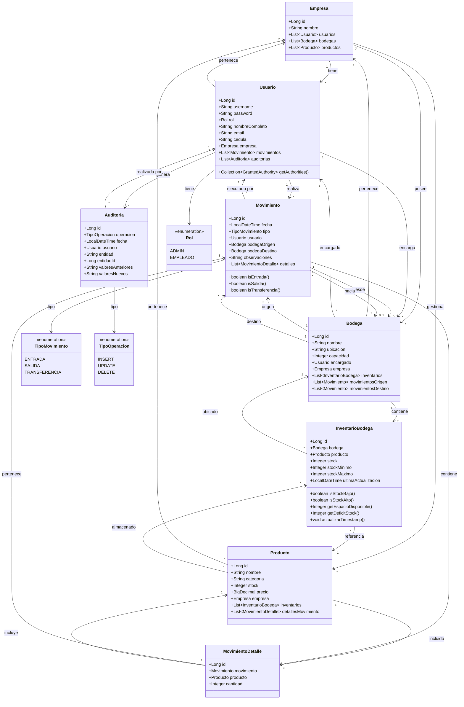
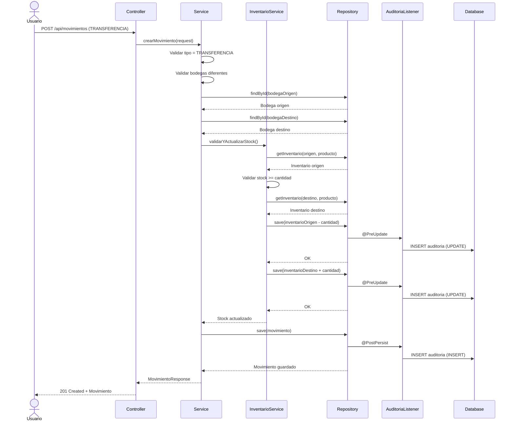

# Diagrama de Clases - LogiTrack

Este diagrama muestra las principales entidades del dominio y sus relaciones en el sistema LogiTrack.

## Diagrama UML de Clases



## Descripción de las Clases Principales

### Entidades de Negocio

#### Empresa
- **Propósito**: Multitenancy, permite aislar datos por empresa
- **Relaciones**: Contiene Usuarios, Bodegas y Productos
- **Validaciones**: Nombre único, no nulo

#### Usuario
- **Propósito**: Usuarios del sistema con autenticación
- **Roles**: ADMIN o EMPLEADO
- **Seguridad**: Implementa UserDetails para Spring Security
- **Validaciones**: Username único, email válido, contraseña BCrypt
- **Campos especiales**:
  - `cedula`: Identificación única (6-20 dígitos)
  - `password`: Hash BCrypt

#### Bodega
- **Propósito**: Almacenes físicos distribuidos geográficamente
- **Campos clave**:
  - `ubicacion`: Dirección física
  - `capacidad`: Máxima cantidad de productos
  - `encargado`: Usuario responsable
- **Validaciones**: Capacidad > 0, nombre único por empresa

#### Producto
- **Propósito**: Catálogo de productos comercializados
- **Campos clave**:
  - `categoria`: Clasificación del producto
  - `stock`: Stock global (calculado)
  - `precio`: Precio unitario
- **Validaciones**: Precio >= 0.01, stock >= 0, nombre único por empresa

#### InventarioBodega
- **Propósito**: Stock real de cada producto en cada bodega
- **Campos clave**:
  - `stock`: Cantidad actual
  - `stockMinimo`: Umbral para alertas
  - `stockMaximo`: Capacidad máxima
- **Métodos útiles**:
  - `isStockBajo()`: Stock < stockMinimo
  - `isStockAlto()`: Stock > stockMaximo
  - `getEspacioDisponible()`: stockMaximo - stock
- **Validaciones**: Stock >= 0, unique(bodega, producto)

#### Movimiento
- **Propósito**: Registro de transacciones de inventario
- **Tipos**:
  - `ENTRADA`: bodegaOrigen = null, bodegaDestino != null
  - `SALIDA`: bodegaOrigen != null, bodegaDestino = null
  - `TRANSFERENCIA`: ambas bodegas != null
- **Actualización automática**: Modifica InventarioBodega al crearse
- **Validaciones**: Lógica según tipo, stock suficiente

#### MovimientoDetalle
- **Propósito**: Productos incluidos en cada movimiento
- **Campos**: Producto, cantidad
- **Validaciones**: Cantidad > 0, unique(movimiento, producto)

#### Auditoria
- **Propósito**: Trazabilidad completa de cambios
- **Tipos de operación**: INSERT, UPDATE, DELETE
- **Registro automático**: Via @EntityListeners
- **Campos JSON**:
  - `valoresAnteriores`: Serialización del objeto antes del cambio
  - `valoresNuevos`: Serialización del objeto después del cambio

### Enumeraciones

#### Rol
- `ADMIN`: Acceso completo al sistema
- `EMPLEADO`: Acceso limitado a operaciones

#### TipoMovimiento
- `ENTRADA`: Ingreso de mercancía desde proveedor
- `SALIDA`: Despacho de mercancía a cliente
- `TRANSFERENCIA`: Movimiento entre bodegas

#### TipoOperacion
- `INSERT`: Creación de registro
- `UPDATE`: Modificación de registro
- `DELETE`: Eliminación de registro

## Patrones de Diseño Utilizados

### 1. Repository Pattern
- Interfaces que extienden `JpaRepository<T, ID>`
- Abstracción del acceso a datos
- Métodos de consulta personalizados

### 2. Service Layer Pattern
- Capa de lógica de negocio independiente
- Transacciones manejadas con `@Transactional`
- Validaciones de negocio

### 3. DTO Pattern
- Objetos de transferencia de datos
- Separación entre entidades y API
- Ejemplos: `LoginRequest`, `MovimientoRequest`, `ReporteResumen`

### 4. Entity Listener Pattern
- `AuditoriaListener` escucha eventos JPA
- Registro automático de auditoría
- Métodos: `@PostPersist`, `@PreUpdate`, `@PreRemove`

### 5. Strategy Pattern (implícito)
- Diferentes estrategias según `TipoMovimiento`
- Validaciones específicas por tipo
- Actualización de inventario según tipo

## Validaciones por Capa

### Nivel de Entidad (Bean Validation)
```java
@NotNull
@NotBlank
@Size(min, max)
@Min, @Max
@DecimalMin
@Email
@Pattern
@Column(unique=true)
```

### Nivel de Negocio (Services)
- Stock suficiente para salidas/transferencias
- Bodegas correctas según tipo de movimiento
- Capacidad de bodega no excedida
- Usuario pertenece a la misma empresa
- Bodegas diferentes en transferencias

### Nivel de Base de Datos
- Constraints CHECK
- Foreign Keys con cascadas
- Unique constraints
- Triggers de actualización

## Diagrama de Secuencia: Crear Movimiento de Transferencia



## Notas de Implementación

### Auditoría Automática
Todas las entidades principales tienen `@EntityListeners(AuditoriaListener.class)`:
- Bodega
- Producto
- Usuario
- InventarioBodega
- Movimiento
- MovimientoDetalle
- Auditoria (auto-auditoría)
- Empresa

### Lazy vs Eager Loading
- **Eager**: Relaciones frecuentemente accedidas (Usuario en Bodega, Producto en InventarioBodega)
- **Lazy**: Relaciones grandes o poco frecuentes (listas de movimientos, detalles)

### Índices de Base de Datos
- Primary Keys: Automáticos
- Foreign Keys: Automáticos
- Unique constraints: (bodega_id, producto_id) en inventario_bodega
- Unique constraints: (movimiento_id, producto_id) en movimiento_detalle

### Transaccionalidad
- Servicios marcados con `@Transactional`
- Rollback automático en excepciones
- Aislamiento de transacciones por empresa

---

[⬅ Volver al README principal](../README.md)
