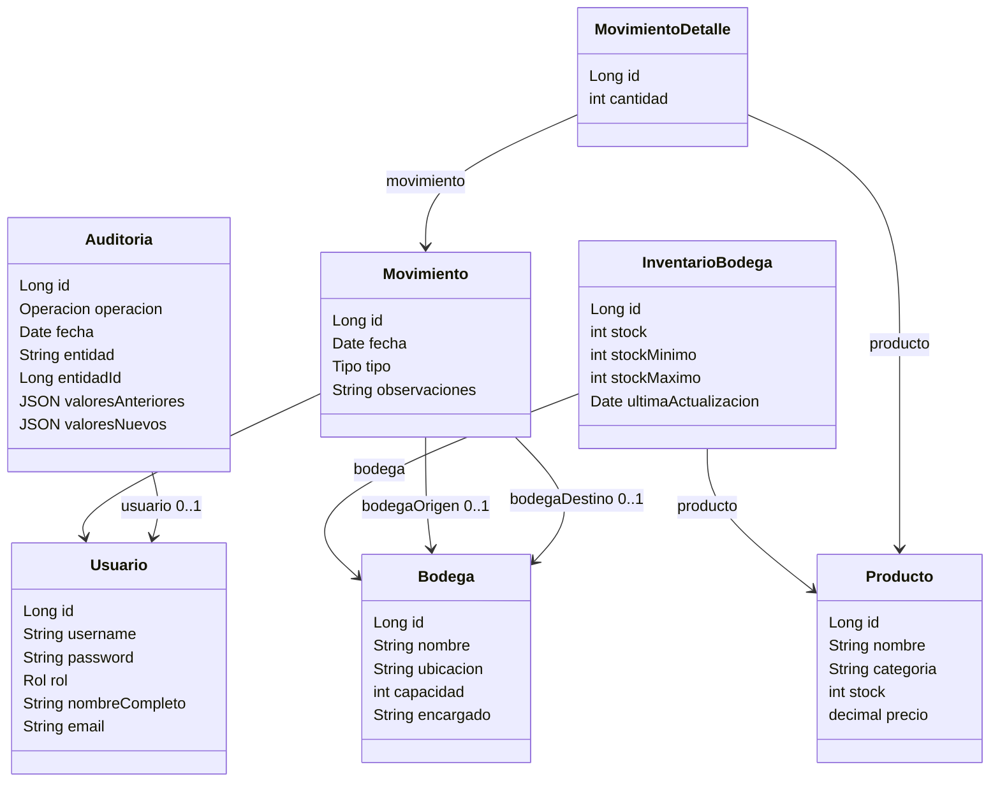

# LogiTrack • Documento Explicativo

## Diagrama de clases


## Arquitectura
- Capas:
  - Controladores REST (`src/main/java/com/logitrack/controller/*`): exposición de endpoints (ej. `ReporteController.java`, `MovimientoController.java`).
  - Servicios (`src/main/java/com/logitrack/service/*`): reglas de negocio y validaciones.
  - Repositorios (`src/main/java/com/logitrack/repository/*`): acceso a datos JPA.
  - Seguridad (`src/main/java/com/logitrack/security/*`): JWT y reglas de autorización.
- Puntos clave:
  - Filtro de seguridad y reglas de acceso: `src/main/java/com/logitrack/security/SecurityConfig.java:31`.
  - Login y registro: `src/main/java/com/logitrack/controller/AuthController.java:34`, `:48`.
  - Emisión/validación de tokens: `src/main/java/com/logitrack/security/JwtTokenProvider.java:28`.
  - Auditoría automática vía listener: `src/main/java/com/logitrack/config/AuditoriaListener.java:28`.
  - Swagger OpenAPI: `src/main/resources/application.properties:1-49`.

## Ejemplo de JWT y uso
- Login
```bash
curl -X POST http://localhost:8081/api/auth/login \
  -H "Content-Type: application/json" \
  -d '{"username":"admin","password":"admin123"}'
```
- Respuesta
```json
{ "token": "<JWT>" }
```
- Uso en endpoints protegidos
```bash
curl -H "Authorization: Bearer <JWT>" http://localhost:8081/api/productos
```

## Integración Frontend
- Base de API y cliente:
  - `frontend/src/main.jsx:7` → `const API_BASE = window.location.origin + "/api"`.
  - `frontend/src/main.jsx:9` → función `api(path, options)` con `fetch` y manejo de errores/abort.
- Desarrollo con proxy:
  - Configuración: `frontend/vite.config.js:7` usando `VITE_API_PROXY_TARGET`.
  - Ejecución: `$env:VITE_API_PROXY_TARGET="http://localhost:8081"; npm run dev`.